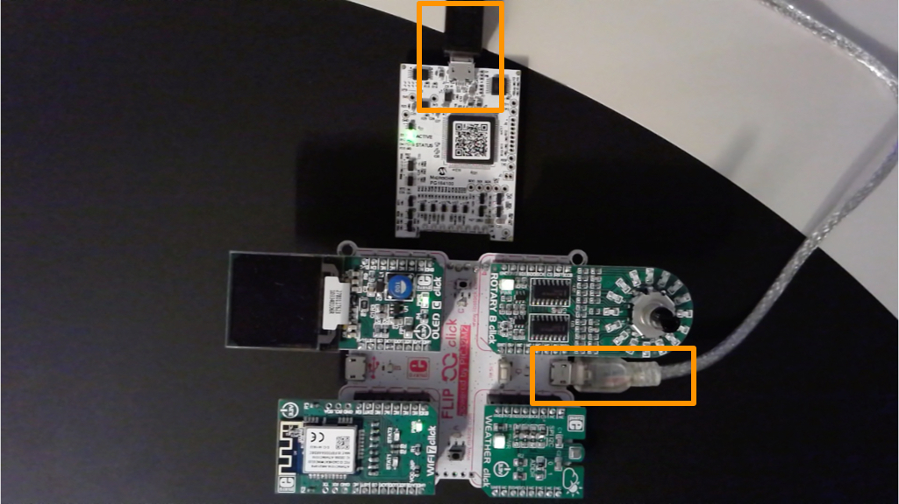
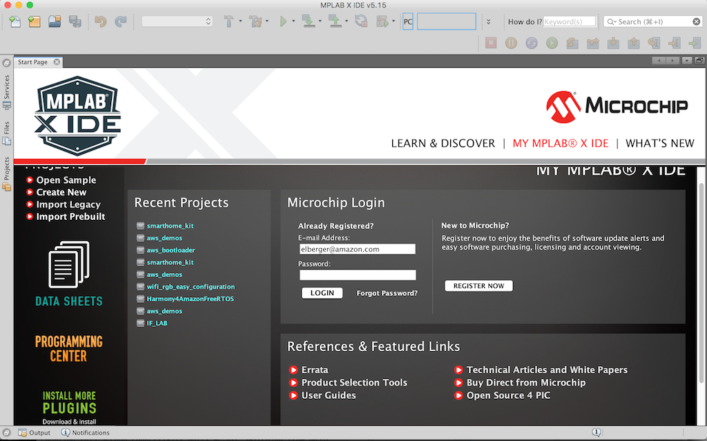
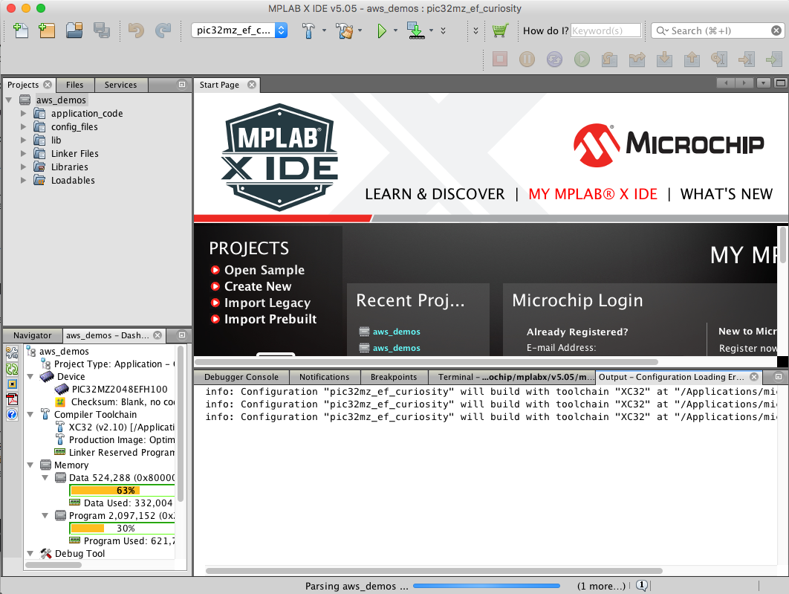
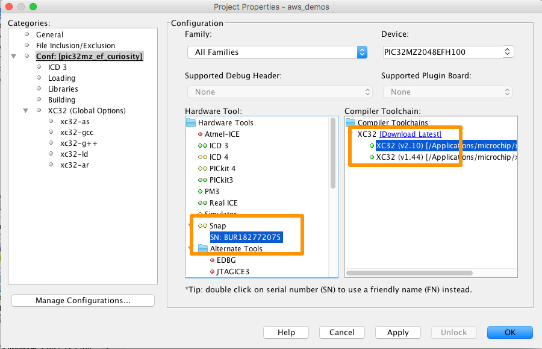
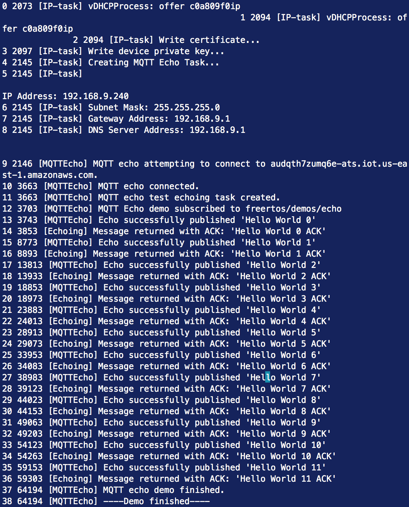
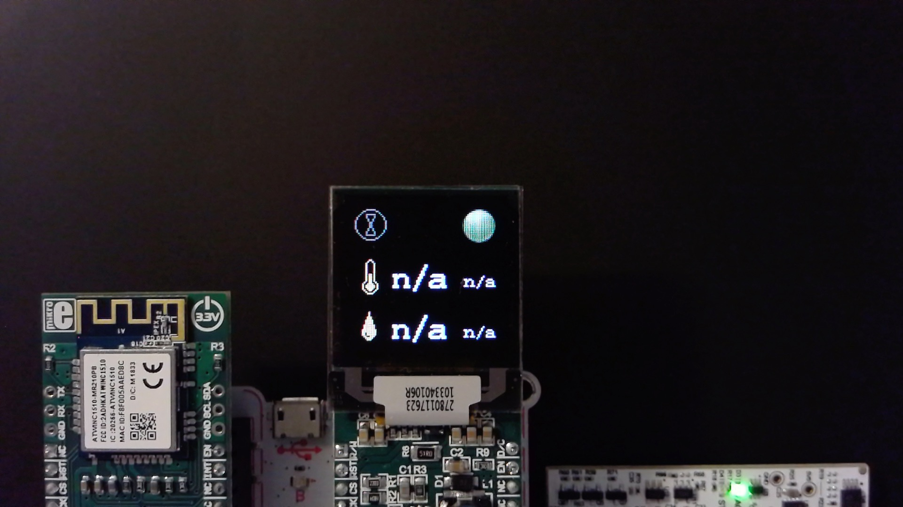

# Section 2. Establish Amazon FreeRTOS Connectivity

In this lab we will establish basic connectivity to the AWS cloud for the Smart Home kit running Amazon FreeRTOS.  In order to do this, we need to establish a unique device identity that enables authentication to AWS IoT Core.  This is done through a client certificate and private key.  You will need to create these credentials in your AWS account and then configure them to each device.

- Identify MQTT Agent connect and disconnect APIs
- Understand MQTT Agent use of Secure Socket PAL
- Understand MQTT Agent use of PKCS PAL

## Configure AWS IoT Credentials

In this section, you will configure and deploy AWS IoT Core credentials and configure them to your source code project. The physical credential files, the private key and the certificate for each device will be placed in ```$HOME/aws-mikroe-smarthome-pic32mz/credentials/PREFIX-thermostat```, where PREFIX is a unique PREFIX you will use so you have no conflict with anyone else using the same AWS Account.

1. In your GNU shell interface, navigate to the directory containing the scripts.

   ```bash
   cd $HOME/aws-mikroe-smarthome-pic32mz/scripts
   ```
     
2. Run the script that configures the credentials for the devices to connect to your AWS account through AWS IoT. The edge hardware that you are using in this workshop is uniquely identified with a group prefix within your AWS account. This allows people at multiple tables who may be sharing a corporate AWS account to operate with their own hardware. Make the prefix match the same value used in the previous lab.

   ```bash
   ./deploy-awsiot-objects.sh <prefix>
   ```

   When the script completes, the keys and certificates will be in the directories specified above. 

After running the script, your credentials and configuration should be deployed to the source tree.

## Power on and Connect to Wi-Fi

In this section, you will learn how to:

- Power on the device
- Program the device
- Identify Wi-Fi connectivity APIs

### Powering on the Device

Note: the device may already be powered on 

To power on the device, plug one end of the USB cable to the Flip N Click device, and the other end of the cable to your computer. The same connection is used for serial output.

To prepare the device for debugging, connect one end of the USB cable to the MPLAB SNAP device and the other end of the cable to your computer.



### Opening the Project

Start MPLAB X.  The start page should appear.



Open the project.  Use ```File > Open Project...``` in MPLAB X.  From within the dialog box that pops up, navigate to the project directory.  Select ```aws-mikroe-smarthome-pic32mz > amazon-freertos > demos > microchip > curiosity_pic32mzef > mplab```.  Click **Open Project**.



### Build and Debug

Before building the project for Debugging, you must select the debugger.  Right-click the project root and click **Properties**.  Ensure that **Conf: [pic32mz\_ef\_curiosity]** is selected on the left side of the dialog box.  On the right-hand side, under **Hardware tool:**, select the Snap debugger - there will be a serial number similar to the following.  NOTE:  If your XC32 compiler is not version 2.10, you will need to change your Bootloader compiler version accordingly.  It will likely be easier to install the XC32 v2.10 compiler.



After selection, click **OK**.

To build the project, click the down arrow next to the hammer icon in the toolbar and click **Build for Debugging (Project smarthome_kit)**. 


Farther along to the right on the toolbar, you will find an icon that looks like a breakpoint with a little green arrow.


Ensure that your serial connection is still present (this was done in Section 1).  Click the down arrow next to it and select **Debug Project (smarthome\_kit)**.  The debugging process starts by first clearing the memories on the target and then flashing the memories.

Once connected, you will see output similar to the following.



Awesome! You connected to the AWS Cloud with the basic demo program.  Now let's use the same principles to not only connect to the cloud but to graphically show the connection on the LCD screen.

## Building Connectivity to Your App

Let's take what we learned in the previous section and build it into the application.

Modify ```aws_home_automation_demo.h``` to include the capabilities for this section.  After modification, the ```#define``` code should look similar to the following.

```c
...
#define AWS_WORKSHOP 1

#if AWS_WORKSHOP == 1
#define AWS_WORKSHOP_SECTION_2_CONN_1    1
#define AWS_WORKSHOP_SECTION_2_CONN_2    1
#define AWS_WORKSHOP_SECTION_3_TELEMETRY 0
#define AWS_WORKSHOP_SECTION_4_SHADOW    0
#define AWS_WORKSHOP_SECTION_5_OTA       0
#else
...
```

When enabling this second connectivity part, we are switching from basic demo mode to the smart home demo mode.  The switching happens in ```main.c```, line 185.

```c
#if AWS_WORKSHOP_SECTION_2_CONN_1 == 1 && AWS_WORKSHOP_SECTION_2_CONN_2 == 0
            DEMO_RUNNER_RunDemos();
#else
            vStartRemoteHVACDemo();
#endif
```

These functions run Tasks, which is a formal way to organize code blocks in FreeRTOS.

Open the file ```aws_remote_hvac.c```.  In this step, we will set a breakpoint at line 356 to walk through how the demo program is using the MQTT Client which is leveraging the Secure Socket PAL implementation.  In effect, the developer does not need to know the details of setting up the secure socket connection to the AWS Cloud.

1. Open file ```aws_remote_hvac.c```.
2. Navigate to line 356 and set a breakpoint by clicking next to the line number.
3. Compile the sources.
4. Start debugging the project by invoking Debug Project from the MPLAB X toolbar.
5. Note in the serial connection terminal the WINC1510 connects to the Wi-Fi access point.
6. The code should break at the ```MQTT_AGENT_Connect``` function call.

   Note that the call uses parameters defined in structure ```xConnectParameters```.  This structure configuration begins on line 304.
   
7. Login to the AWS Console using your IAM credentials if not logged in already.
8. From the title bar, choose **Services > IoT Core**.
9. From the left hand side, choose **Test**.
10. In the MQTT client, click **Subscribe to a topic**.
11. In the Subscription topic text field, and replacing CLIENT_ID with your Client ID, input:

    ```text
    $aws/events/presence/connected/CLIENT_ID
    ```
    
    And click the **Subscribe to topic** button.  In AWS IoT Core, this special topic is for Lifecycle Events.  You can read more about this in the [documentation for Lifecycle Events](https://docs.aws.amazon.com/iot/latest/developerguide/life-cycle-events.html).  
8. Step over the code using the step over button.  Step over until the cursor is over the call to ```xQueueSend```.

   *Queues are a way to decouple discrete code blocks in tasks.  The task responsible for managing the UI aspect consumes this message to be notified that a connect event occurred successfully.*

12. Press the large green debug arrow (or F5) to continue with the program execution.
13. Press the button to finish the debugging session (or SHIFT-F5).

After the connection, you may have noticed the green circle being filled:



## Persisting Data to DynamoDB

In this section, a DynamoDB table will be setup to capture AWS IoT Lifecycle Events.  When an event occurs, such as a client connection (from device code), an AWS IoT Rule Engine rule evaluates the event topic and puts the data into the DynamoDB table.

### Creating the DynamoDB Table

Let's first look at what the Lifecycle Event data gives us so an effective decision on the table schema can be made.  The 'U' column denotes global uniqueness.

| U | Attribute           | Connected | Disconnected | Subscribed | Unsubscribed |
|---+---------------------+-----------+--------------+------------+--------------|
| X | clientId            | X         | X            | X          | X            |
|   | timestamp           | X         | X            | X          | X            |
|   | eventType           | X         | X            | X          | X            |
| X | sessionIdentifier   | X         | X            | x          | X            |
|   | principalIdentifier | X         | X            | X          | X            |
|   | topics              |           |              | X          | X            |

The interest is reporting which clients are emitting events. In such case, the composite primary key will be clientId (HASH) and timestamp (RANGE).

We will start by creating AWS objects from the leaf of the runtime dependency chain.  Start by creating the DynamoDB Table where the Lifecycle Event data will be persisted.  **REPLACE PREFIX with your user defined PREFIX!**

```bash
aws dynamodb create-table                                             \
    --table-name             PREFIX_IotLifecycleEvents                \
    --attribute-definitions  AttributeName=clientId,AttributeType=S   \
                             AttributeName=timestamp,AttributeType=N  \
    --key-schema             AttributeName=clientId,KeyType=HASH      \
                             AttributeName=timestamp,KeyType=RANGE    \
    --billing-mode           PAY_PER_REQUEST
```

### Setup AWS IoT Rule Engine Topic Rules

To record all of the Lifecycle Events, we can create four separate Topic Rules or a single Topic Rule.  In this case, we create a Topic Rule capturing all Lifecycle Events.  There is no need to setup a Rule for each client; the rule will be setup to work for any clientId reporting a Lifecycle Event.

First we'll enable actions from AWS IoT to DynamoDB by adding permissions to our Role Policy. First, let's create the policy with the name ```iotbc-iot-role-trust.json```.  You can use vi or your favorite text editor to create the document.

```json
{
  "Version": "2012-10-17",
  "Statement": [
    {
      "Effect": "Allow",
      "Principal": {
        "Service": "iot.amazonaws.com"
      },
      "Action": "sts:AssumeRole"
    }
  ]
}
```

Now create the role. **REPLACE PREFIX with your user defined PREFIX!**

```bash
aws iam create-role \
    --role-name PREFIX-iot-bootcamp \
    --assume-role-policy-document file://iotbc-iot-role-trust.json
```

Create the following permissions document named ```iotbc-iot-role-permission-ddb.json```.  **IMPORTANT**: change the Region and Account ID in the ARN.  Your Account ID can be found in the AWS Console in **My Account**.  **REPLACE PREFIX with your user defined PREFIX!**

```json
{
  "Version": "2012-10-17",
  "Statement": {
    "Effect": "Allow",
    "Action": "dynamodb:PutItem",
    "Resource": "arn:aws:dynamodb:[REGION]:[ACCOUNT_ID]:table/PREFIX_IotLifecycleEvents"
  }
}
```

Now add the permissions policy to the ```iot-bootcamp``` Role.  **REPLACE PREFIX with your user defined PREFIX!**

```bash
aws iam put-role-policy \
    --role-name PREFIX-iot-bootcamp \
    --policy-name iot-ddb-IotLifecycleEvents \
    --policy-document file://iotbc-iot-role-permission-ddb.json
```

Create the ```connected``` rule.  The rule SQL uses the ```+``` wildcard to capture all events for your Client ID.

Create the Rule JSON file named ```DynamoDBRule.json```.  **IMPORTANT**: change the Region and Account Number in the ARN. Replace the CLIENT_ID with your Client ID. **REPLACE PREFIX with your user defined PREFIX!**

```json
{
  "sql": "select * from '$aws/events/presence/+/CLIENT_ID'",
  "description": "Get lifecycle events and put them to DynamoDB",
  "ruleDisabled": false,
  "awsIotSqlVersion": "2016-03-23",
  "actions": [
    {
      "dynamoDB": {
        "tableName": "IotLifecycleEvents",
        "roleArn": "arn:aws:iam::012345678910:role/PREFIX-iot-bootcamp",
        "hashKeyField": "clientId",
        "hashKeyValue": "${clientId}",
        "hashKeyType": "STRING",
        "rangeKeyField": "timestamp",
        "rangeKeyValue": "${timestamp}",
        "rangeKeyType": "NUMBER"
      }
    }
  ]
}
```

Create the rule, naming it *LifecycleEvents* and using the Topic Rule payload that was created in the previous step.  **REPLACE PREFIX with your user defined PREFIX!**

```bash
aws iot create-topic-rule \
    --rule-name PREFIX_LifecycleEvents \
    --topic-rule-payload file://DynamoDBRule.json
```
   
### Test the Rule

Run the demo program to receive events, source them from a Rule, and send them to the DynamoDB table.

1. From MPLAB X, run **Debug Project**.  Eventually, the code connects to IoT Core.
2. From MPLAB X, click the Finish Debugger project (or SHIFT-F5).

In the AWS Console:

1. Navigate to the DynamoDB console.
2. On the left-hand side, click *Tables*.
3. In the table list, click IotLifecycleEvents.
4. On the right-hand side, click the *Items* tab.
5. Verify that the messages have been received.


## Outcomes

In this lab we established connectivity to the AWS Cloud using Amazon FreeRTOS running on the PIC32MZ Smart Home kit by MikroElektronika.  You were introduced to the basic concepts of the Connectivity and MQTT Agent Platform Abstraction Layers (PALs), which enable a streamlined development experience.

[Next Lab](./Section3.md)

[Index](./README.md)

Copyright (C) 2018 Amazon.com, Inc. All Rights Reserved.
